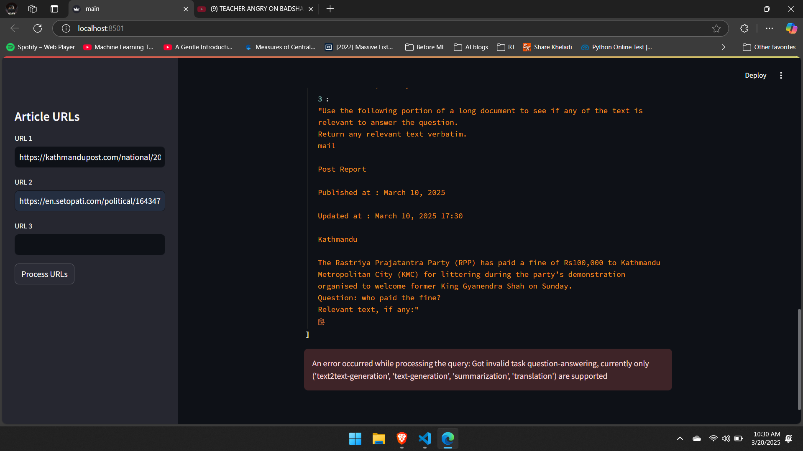

# URL Summarizer

## Overview
This project is a URL Summarizer and Q&A system that processes web articles from given URLs and answers user questions using retrieval-augmented generation (RAG).  
The system uses **LangChain** for retrieval, **Hugging Face's `google/flan-t5-base`** for answer generation, and **FAISS** for efficient document indexing.  
The graphical user interface (GUI) is built using **Streamlit**.

## Features
- **URL Processing** for extracting article content  
- **Question Answering** with natural language queries  
- **Document Retrieval** using FAISS vector index  
- **Answer Generation** with `google/flan-t5-base`  
- **Clean GUI** displaying questions and answers  
- **Local Model Execution** for privacy and speed  

## Project Workflow
1. **URL Input:** Users provide up to three article URLs.  
2. **Content Extraction:** The system loads and processes the URLs.  
3. **Text Splitting:** Articles are split into chunks for indexing.  
4. **Vector Indexing:** FAISS creates a vector index of document embeddings.  
5. **Question Processing:** Users ask a question about the articles.  
6. **Retrieval and Generation:** Relevant chunks are retrieved, and answers are generated.  
7. **GUI Display:** The question and answer are shown in the Streamlit interface.  

## Installation

### Prerequisites
Ensure you have Python installed (version 3.9+ recommended). Install dependencies using:  
```bash
pip install -r requirements.txt
```
```bash
streamlit run main.py
```



